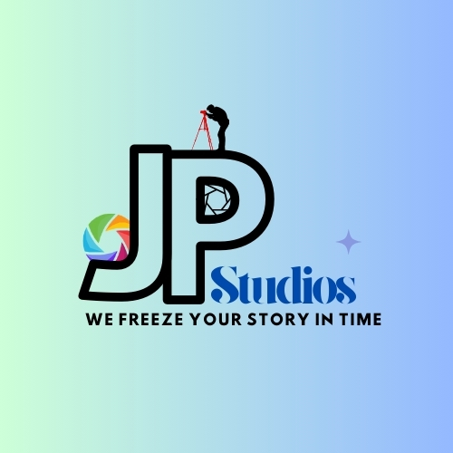

<a name="readme-top">

<br/>

<br />
<div align="center">
  <a href="https://github.com/zyx-0314/">
  <!-- TODO: If you want to add logo or banner you can add it here -->
    
  </a>
<!-- TODO: Change Title to the name of the title of your Project -->
  <h3 align="center">WD-PACHEJO-MIDTERMS</h3>
</div>
<!-- TODO: Make a short description -->
<div align="center">
  Project Overview
The nature of this project is to upgrade a regular static CV into an engaging and animated web resource. • The purpose is to have a web space to share basic personal information, employment history, education, skills and samples of work, providing an appealing method of presenting an employment application.

For instance, the website layout has sections like About Me, Experience, Education, Skills and Portfolio. All major sections contain the down-scaled, but detailed information in a contemporary, adaptively arranged manner.

Purpose
The main objective of the project is the presentation of the resume of the photographer and the director, the subject of the profile, named Joshua David J. Pachejo, in the technically advanced format, aiding further promotion and easy access.

Key Components
Flexible multiple-page layout for resume sections
The layout of portfolio items as the next activity (photos)
Top navigation bar connected each other interacting.
Appealing background and header images for design
Designing website to fit in to the various types of devices that are in use today.
Technology Used
HTML for structuring content
CSS for styling and layout
Bootstrap for initial layout and styling and for the navigation bar and carousel, horizontal scrolling techniques
For dynamic features the best choice can be JavaScript.
This website provides a clear presentation of a modern digital resume, as in today’s world people use technology to represent themselves.e 
</div>

<br />

<!-- TODO: Change the zyx-0314 into your github username  -->
<!-- TODO: Change the WD-Template-Project into the same name of your folder -->


---

<br />
<br />

<!-- TODO: If you want to add more layers for your readme -->
<details>
  <summary>Table of Contents</summary>
  <ol>
    <li>
      <a href="#overview">Overview</a>
      <ol>
        <li>
          <a href="#key-components">Key Components</a>
        </li>
        <li>
          <a href="#technology">Technology</a>
        </li>
      </ol>
    </li>
    <li>
      <a href="#rule,-practices-and-principles">Rules, Practices and Principles</a>
    </li>
    <li>
      <a href="#resources">Resources</a>
    </li>
  </ol>
</details>

---

## Overview

<!-- TODO: To be changed -->
<!-- The following are just sample -->
Description of the project in details.

Guiding Question:
- What is the project
- Whats the purpose
- What are key components
- What technology used and how it is used

### Key Components
<!-- TODO: List of Key Components -->
<!-- The following are just sample -->
- MultiPage Website/Single Page Website
- Parallax transition
- Transactional

### Technology
<!-- TODO: List of Technology Used -->


## Rules, Practices and Principles
1. Always use `WD-` in the front of the Title of the Project for the Subject followed by your custom naming.
2. Do not rename any .html files; always use `index.html` as the filename.
3. Place Files in their respective folders.
4. All file naming are in camel case.
   - Camel case is naming format where there is no white space in separation of each words, the first word is in all lower case while the succeding words first letter are in upper followed by lower cased letters.
   - ex.: buttonAnimatedStyle.css
5. Use only `External CSS`.
6. Renaming of Pages folder names are a must, and relates to what it is doing or data it holding.
7. File Structure to follow below.

```
WD-ProjectName
└─ assets
|   └─ css
|   |   └─ style.css
|   └─ img
|   |   └─ fileWith.jpeg/.jpg/.webp/.png
|   └─ js
|       └─ script.js
└─ pages
|  └─ pageName
|     └─ assets
|     |  └─ css
|     |  |  └─ style.css
|     |  └─ img
|     |  |  └─ fileWith.jpeg/.jpg/.webp/.png
|     |  └─ js
|     |     └─ script.js
|     └─ index.html
└─ index.html
└─ readme.md
```

## Resources

<!-- TODO: Add References -->
| Title | Purpose | Link |
|-|-|-|
| Sample Title | Sample purpose would be here like this and this is the example of what it is. | trykolang.com |
